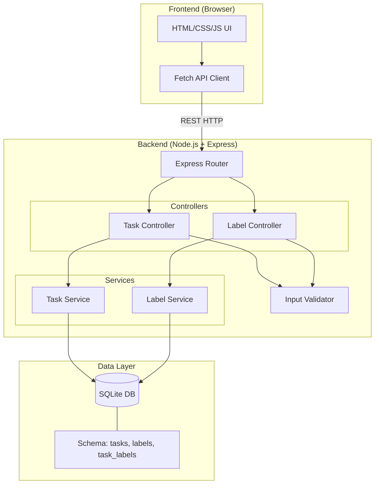
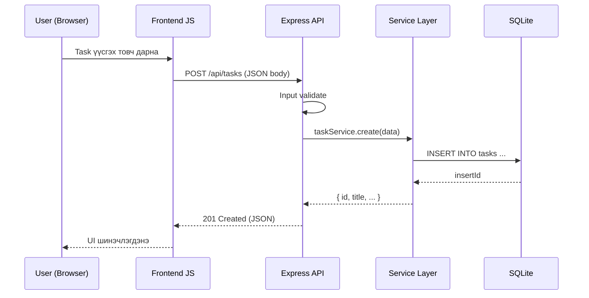
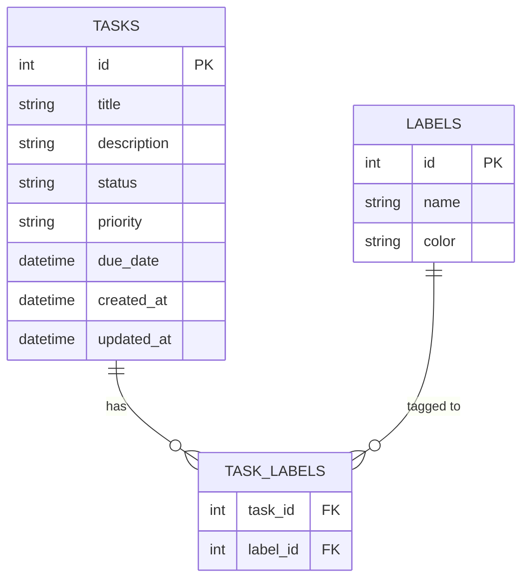

# ARCHITECTURE.md — Personal Task Tracker

## Системийн архитектур

### Давхаргын диаграм (Layer Diagram)

### Өгөгдлийн урсгал (Data Flow)

### Өгөгдлийн загвар (Data Model)

## Module тайлбар

| Module | Зам | Үүрэг |
|--------|-----|-------|
| Entry point | `src/index.js` | Express app эхлүүлэх, port listen |
| Router | `src/routes/` | URL → Controller холбох |
| Task Controller | `src/controllers/taskController.js` | HTTP request/response зохицуулах |
| Label Controller | `src/controllers/labelController.js` | Label CRUD |
| Task Service | `src/services/taskService.js` | Business logic, DB query |
| Label Service | `src/services/labelService.js` | Label business logic |
| DB | `src/db/database.js` | SQLite connection, schema init |
| Validator | `src/middleware/validator.js` | Input validation middleware |
| Frontend | `public/` | Static HTML, CSS, JS |

## API Endpoint-үүд

| Method | URL | Үйлдэл |
|--------|-----|--------|
| GET | `/api/tasks` | Бүх task жагсаах (filter/search дэмжинэ) |
| POST | `/api/tasks` | Шинэ task үүсгэх |
| GET | `/api/tasks/:id` | Нэг task харах |
| PUT | `/api/tasks/:id` | Task засах |
| DELETE | `/api/tasks/:id` | Task устгах |
| PATCH | `/api/tasks/:id/status` | Статус өөрчлөх |
| GET | `/api/labels` | Бүх label жагсаах |
| POST | `/api/labels` | Шинэ label үүсгэх |
| DELETE | `/api/labels/:id` | Label устгах |
